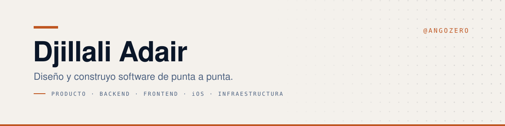

  <picture>
    <source media="(prefers-color-scheme: dark)" srcset="assets/banner-dark.svg" />
    
  </picture>

  
  
  

---

## Lo que hago

Tomo una idea de negocio y la dejo corriendo en producción, atendida.

Trabajo solo y de punta a punta: entiendo el problema, decido el alcance, modelo los
datos, escribo el backend y el frontend, levanto la infraestructura, despliego y me
quedo a cuidar lo que se rompe. No entrego un demo bonito que alguien más tiene que
terminar; entrego algo que un negocio abre el lunes a las ocho de la mañana.

Lo hago para PyMEs de México, así que diseño para la realidad de acá: teléfonos de
gama baja, señal irregular, gente que nunca usó un panel de administración y no debería
tener que aprender.

## Lo que puedo hacer

| Capa | Lo que entrego |
|---|---|
| **Producto** | Del problema difuso al alcance cerrado: qué se construye, qué se deja fuera y en qué orden se lanza. |
| **Backend** | APIs en Laravel con multi-tenencia, control de acceso, cobros, correo transaccional y un esquema que aguanta crecer. |
| **Frontend** | Paneles, tiendas y landings en React, TypeScript y Astro. Rápidas en un teléfono viejo, no solo en mi Mac. |
| **Móvil** | Apps nativas de iOS en SwiftUI, con datos locales y sincronización. |
| **Infraestructura** | Docker, Caddy, CI en GitHub Actions y despliegue a servidor propio con vuelta atrás. |
| **Operación** | Respaldos que probé restaurar, monitoreo, incidentes de madrugada y el postmortem del día siguiente. |

## Con qué

<table>
  <tr>
    <td><b>Servidor</b></td>
    <td>
      
      
      
      
      
    </td>
  </tr>
  <tr>
    <td><b>Cliente</b></td>
    <td>
      
      
      
      
      
    </td>
  </tr>
  <tr>
    <td><b>Móvil</b></td>
    <td>
      
      
      
    </td>
  </tr>
  <tr>
    <td><b>Infraestructura</b></td>
    <td>
      
      
      
      
      
    </td>
  </tr>
</table>

## Cómo trabajo

> **Terminar vale más que empezar.**
> Lo que queda a medias no le sirve a nadie, por bonito que se haya visto en la maqueta.

> **La tecnología aburrida gana.**
> Elijo la herramienta con menos sorpresas a dos años, no la que se ve mejor en un tuit.

> **Si no lo verifiqué, no está hecho.**
> Pruebas que corren, respaldos que restauré, despliegues que revertí a propósito para saber que se puede.

> **Borrar también es avanzar.**
> Cada dependencia, bandera y abstracción de más se paga todos los meses. La mejor línea es la que no existe.

> **El software habla el idioma de quien lo usa.**
> Español con acentos y con ñ, palabras del negocio y no del programador, errores que dicen qué hacer.

> **Diseño para el peor teléfono, no para el mío.**
> Si funciona con señal mala en un rancho, funciona en cualquier lado.

## Actividad

  <picture>
    <source media="(prefers-color-scheme: dark)" srcset="https://streak-stats.demolab.com?user=AngoZero&locale=es&theme=tokyonight&hide_border=true&date_format=j%20M%5B%20Y%5D" />
    
  </picture>

  <picture>
    <source media="(prefers-color-scheme: dark)" srcset="https://github-readme-activity-graph.vercel.app/graph?username=AngoZero&hide_border=true&theme=tokyo-night&area=true" />
    
  </picture>

---

<strong>English</strong>

 

### What I do

I take a business idea and leave it running in production, looked after.

I work alone and end to end: I scope the problem, model the data, write the backend and
the frontend, stand up the infrastructure, deploy it and stay for whatever breaks. Not a
pretty demo someone else has to finish — something a business opens on Monday at eight.

I build for small and medium businesses in Mexico, so I design for what is actually there:
cheap phones, patchy signal, and people who have never used an admin panel and shouldn't
have to learn.

### What I can do

| Layer | What I deliver |
|---|---|
| **Product** | From a fuzzy problem to a closed scope: what gets built, what is left out, what ships first. |
| **Backend** | Laravel APIs with multi-tenancy, access control, payments, transactional mail and a schema that survives growth. |
| **Frontend** | Dashboards, storefronts and landing pages in React, TypeScript and Astro. Fast on an old phone, not just on my Mac. |
| **Mobile** | Native iOS apps in SwiftUI, with local data and sync. |
| **Infrastructure** | Docker, Caddy, GitHub Actions CI and deployment to my own servers, with a way back. |
| **Operations** | Backups I restored on purpose, monitoring, 3 a.m. incidents and the postmortem the next day. |

### How I work

- **Finishing beats starting.** Half-built helps no one, however good the mockup looked.
- **Boring technology wins.** I pick the tool with the fewest surprises two years out.
- **If I didn't verify it, it isn't done.** Tests that run, backups I restored, deploys I rolled back on purpose.
- **Deleting is progress too.** Every extra dependency, flag and abstraction bills you monthly.
- **Software speaks the user's language.** Their words, not the programmer's; errors that say what to do.
- **I design for the worst phone, not mine.** If it works on bad signal out on a ranch, it works anywhere.

Mostly Laravel, PostgreSQL, TypeScript, React, Astro, Swift and Docker. Most of my work lives in private repositories.

  ¿Tienes algo que construir? <a href="mailto:angozero99@gmail.com">angozero99@gmail.com</a>

